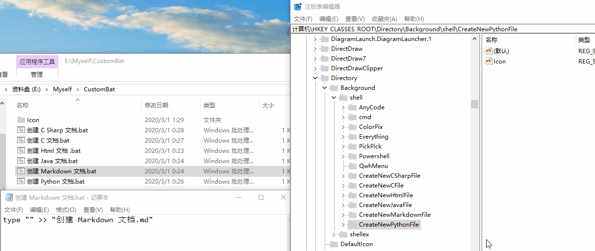

```text
title: jie-jue-fang-an.md
date: 2017-08-14 14:52
```


# 解决方案


<!DOCTYPE html>
<html>
	<head>
		<meta charset="utf-8" />
		<title>记事本</title>
		<style type="text/css">
			#img{
				width: 120px;
				height: 120px;
				border: 1px solid red;
				margin: auto;
			}
		</style>
		<script type="text/javascript">
			// 初始化图片位置
			var i = 1;
			window.setInterval(function changeImg(){
				i++;
				document.getElementById("changeImg").src="../Markdown/img/"+ i +".jpg";
				// 第5张依然会显示
				if(i == 5)i = 0;
			}, 3000);
		</script>
	</head>
	<body>
		<!-- 导出为 Html 才会有效果 -->
		<div id="img">
			
		</div>
	</body>
</html>


## 功能代码

这里存放了一些已经写好的代码可以直接拿来用, 不需要再次实现某些功能.

<font color="red"><b>离线打开这个文档你需要把 FunctionModule.md 文件和这个文档放在一起</b></font>

[在线: 功能代码](https://gitee.com/StringOD/Solution/blob/master/Markdown/FunctionModule.md)

[本地: 功能代码](..\Markdown\FunctionModule.md)


## Geek Tools List

这里是很多实用的工具.

<font color="red"><b>离线打开这个文档你需要把 GeekToolsList.md 文件和这个文档放在一起</b></font>

[在线: 功能代码](https://gitee.com/StringOD/Solution/blob/master/Markdown/GeekToolsList.md)

[本地: 功能代码](..\Markdown\GeekToolsList.md)


## MIUI相册：xiaomi云服务文件路径
默认文件路径:C:\Users\Administrator\AppData\Local\MiCloudPC\app-0.1.16

## Visual Studio 2017
### visual c++项目在编译检查scanf\(\)报错提示使用scanf\_s\(\)
1. 项目属性
2. 配置属性
3. c/c++
4. 常规
5. SDL检查设置为:否


### visual c++项目编译完不提示"按任意键结束"

1. 项目属性
2. 连接器
3. 系统
4. 子系统
5. 控制台\(/SUBSYSTEM:CONSOLE\)
* 调试方法:生成\(生成解决方案-生成"xxx"\(如果提示成功0个,则重新生成\)-编译\) -调试\(开始执行\(不调试\)/ctrl+f5\)


## 逻辑运算?
### 首先我们先来介绍三种符号:
1. && 与运算
2. || 运算
3. ! 非运算

1.  && 运算
* "真&&真"为真
* "真&&假"为假
* "假&&真"为假
* "假&&假"为假

2.  || 运算
* "真||真"为真
* "真||假"为真
* "假||真"为真
* "假||假"为假

3. ! 运算
* "!真"为假
* "!假"为真

* **Example**
``` C
int a = 4, b = 8, c = 10;
(a < b) && (b < c) 为真 (a < b) || (a < c) 为真 a < b 为真, !(a < b) 为假
```


## Notepad++ 编译运行C文件
### 编译并运行:单击菜单,选择最上选项”运行“,或直接按下F5.弹出运行窗口
``` text
输入:cmd /k gcc -o "$(CURRENT_DIRECTORY)$(NAME_PART).exe" "$(FULL_CURRENT_PATH)" && CLS && "$(CURRENT_DIRECTORY)$(NAME_PART).exe" & PAUSE & EXIT单击运行即可.
```

### 也可以先编译再运行
#### 编译:
``` text
输入:cmd /k gcc -Wall -o "$(CURRENT_DIRECTORY)$(NAME_PART).exe" "$(FULL_CURRENT_PATH)" & PAUSE & EXIT
```

#### 运行:
``` text
输入:cmd /k "$(CURRENT_DIRECTORY)$(NAME_PART).exe" & PAUSE & EXIT
```


## 添加鼠标右键菜单

1. win+R
2. 输入: `regedit`
3. `计算机\HKEY_CLASSES_ROOT\Directory\Background\shell`
4. 在shell目录下:新建
5. 项\(重命名项的名称\)
6. 新建
7. 字符串
8. 修改
9. “文件绝对路径” 例如：计算机\HKEY\_CLASSES\_ROOT\Directory\Background\shell\babun\(默认项修改显示的文字,新建一个项输入文件绝对路径并且加上",0"来添加图标\)\command\(新建字符串编辑默认字符串输入文件绝对路径\)


## Windows快速启动程序方法

1. 设置path环境变量,添加绝对文件路径即可\(在系统盘新建一个winrun\)
2. 组合键:WIN+R
3. 输入事先设置好的名字回车即可打开\(输入的名字就是winrun下的快捷键名字,比如:vs\)


## 再与SQL Server建立链接时报错
1. 打开SQL Server配置管理器
2. 点击SQL express的协议,我们需要启动所有状态
3. 选择TCP/IP,点击右键,选择属性,修改连接数据库的端口地址

* IP13 IP位本机IP,TCP端口为1433,然后选择启动 已启用:是
* IP8 IP地址为:127.0.0.1 已启用:是
* IPALL TCP端口为1433
* 然后应用确定,并重新启动服务


## Microsoft SQL Server 2008 配置之后,找不到Microsoft SQL Server Management Studio 管理器
* 虽然安装了Mincrosoft Visual Studio XXXX的版本编译器,你都会发现只有"配置工具"没有"管理器" 虽然可以用vs里面的但是我相信对于初学者来说是一脸懵逼,管理器这东西需要单独下载 百度搜索"Microsoft SQL Server Management Studio 17"下载


## 在Mincrosoft Visual Studio编写代码的时候,某些情况下会发现光标变成方块,且输入字符时会替换掉后面的字符
* 按一下键盘上的 insert


## Windows上安装了Visual Studio快速启动方法
1. win+r
2. devenv
3. 回车
* 这个方法并不适用某些版本


## linux启动卡在启动界面
### 第一次启动并没有进入操作系统的解决方法

现象：配备有`intel`集成显卡和`NVIDIA`独立显卡的机器登入图形界面时机器挂起（关机）

原因：Linux对于`NVIDIA`显卡驱动不适配。

解决方案一：如果不启动图形界面，只用`tty`，没有问题。

解决方案二：(你的Linux Display Manager已加入了守护进程，大多数发行版都是如此)

1. 重新启动计算机

2. \(上下\)光标选择启动引导项

3. 按下 e \(部分操作系统是这个键位\)

4. 修改:找到quiet splash替换为 nomodeset

5. F10保存

   >Linux一般默认有安装nouveau开源驱动，所以采用双显卡的电脑在使用Manjaro或者Arch Linux可以在**第一个**quiet后面加入`nouveau.modeset=0`；F10保存后按`Ctrl+X`启动。
   
```text
fi
linux    /boot/vmlinuz-4.10.0-28-generic.efi.signed root=UUID=f1f30085-ee70-4367-befc-7b5f48cbcf5b ro  nomodeset
initrd    /boot/initrd.img-4.10.0-28-generic
```

解决方案三：(Arch系 Linux独有的解决办法；同样已将Display Manager加入了守护进程)

1. 使用一个`Live CD`，将Arch Linux挂载在`Live CD`上，然后使用`arch-chroot`进行操作。
2. 输入下面的命令

```shell
$ sudo pacman -S bumblebee   # 安装bumblebee
$ sudo nano /etc/modprobe.d/modprobe.conf
# 在文件中添加“options nvidia NVreg_Mobile=1”，然后保存退出，重启机器
```

### 进入操作系统之后发现每次启动都需要更改引导文件

1. 打开终端
``` text
sudo gedit /boot/grub/grub.cfg
```
>**gedit**是gnome系Desktop Environment独有的文本编辑器；如果使用的是KDE系桌面，那么应将gedit替换为KDE默认的文本编辑器**Kate**。
2. 看到如下代码:修改倒数第二行`quiet splash`为`nomodeset`
3. 然后在找到倒数第四行的末尾添加:
```text
acpi_osi=Linux nomodeset
```

```text
export linux_gfx_mode
menuentry 'Ubuntu' --class ubuntu --class gnu-linux --class gnu --class os $menuentry_id_option 'gnulinux-simple-f1f30085-ee70-4367-befc-7b5f48cbcf5b' {
	recordfail
	load_video
	gfxmode $linux_gfx_mode
	insmod gzio
	if [ x$grub_platform = xxen ]; then insmod xzio; insmod lzopio; fi
	insmod part_gpt
	insmod ext2
	set root='hd1,gpt6'
	if [ x$feature_platform_search_hint = xy ]; then
	  search --no-floppy --fs-uuid --set=root --hint-bios=hd1,gpt6 --hint-efi=hd1,gpt6 --hint-baremetal=ahci1,gpt6  f1f30085-ee70-4367-befc-7b5f48cbcf5b
	else
	  search --no-floppy --fs-uuid --set=root f1f30085-ee70-4367-befc-7b5f48cbcf5b acpi_osi=Linux nomodeset
	fi
	linux	/boot/vmlinuz-4.10.0-28-generic.efi.signed root=UUID=f1f30085-ee70-4367-befc-7b5f48cbcf5b ro  nomodeset
	initrd	/boot/initrd.img-4.10.0-28-generic
```


## 关闭Linux启动动画
1. 打开终端
2. 输入:`sudo gedit /etc/default/grub`
3. 找到:`grub_cmdline_linux_default="quiet splash`
4. 然后删除:`"quiet splash"`为`""`\(留空\)或者`"text"`

* 某些操作系统需要更新修改的grub文件才能生效`sudo update-grub`
* 但是某些操作系统的更新了grub文件会被重置为初始状态
* 请根据需求做出修改


## VMware虚拟机安装Linux出现卡在启动界面
1. 虚拟机设置
2. 显示器
3. 取消勾选3D图形


## Windows 10 下更改文件夹背景颜色
1. WIN+R
2. 输入:`regedit`
3. 找到:`HKEY_CURRENT_USER\Control Panel\Colors`
4. 在右边找到windwos双击设置\(RGB\)颜色
5. 默认为255 255 255\(设置你喜欢的颜色\)
* 代码编辑器保护眼睛颜色为:30 30 30 一般的重启计算机/注销会生效


## OD中使用Shift + F9直接运行导致程序运行解决方法
1. 选项
2. 调试
3. 设置
4. 取消勾选\(INT3终端,单步终端,非法访问内存,整数除以0,无效或特殊指令,所有FPU异常,同时忽略一下制定的异常或范围\)
5. 插件
6. StrongOD
7. Options
8. 取消勾选\[Skip Some Exceptions\]
9. Save
10. 然后重载程序


## 鼠标右键菜单弹出的位置跑到左边了
1. 控制面板
2. 平板电脑设置
3. 其他
4. 惯用左手


## 程序快捷方式有小箭头图标
* 工具:Dism++
1. 打开Dism++
2. 工具优化
3. 隐藏桌面小箭头


## 之前用F12调试那些收费的网站资源是通过网页启动加载资源从中截取数据实现的

但是现在的网站为了避免这种事情的发生,从而使用了调用资源的方式,也就是说吧资源 存储在一个变量里面,在用的时候直接使用js调用并加载

1. 查看网页源码
2. 找到播放按钮的布局位置
3. 从而找到JS代码的位置就能获取资源


## 调整光标粗细
1. 设置
2. 轻松实用
3. 其它选项
4. 视觉选项


## 我的世界低版本打开高版本存档报错\(Android\)

1. 新建地图
2. 然后输入\(打不开高版本地图\)相同的种子
3. 然后创建世界 然后打开文件管理器将高版本minercraftworld下的db文件夹覆盖到新建地图目录下\(替换db文件夹\)


## VMware 安装 MacOS 10.13启动报错

1. 打开该目录
2. 找到macOSxx.xx.vmx文件\(这里的文件是：macOS 10.12 \(2\).vmx\)
3. 右键用记事本方式打开
4. 找到 smc.present = “TRUE”在smc.present = “TRUE”下面
5. 手动添加一行smc.version= "0"然后保存关闭
6. 再重新启动虚拟机


## CK-DE Direct运行库修复后依然报错
1. 打开控制面板
2. 程序和功能
3. 启用或关闭windows功能
4. 勾选旧版本组件
5. DirectPlay
6. 确定\(可以不联网\)


## Notepad++崩溃导致文档数据被格式化
### 如果你的Notepad++在使用中没有出现任何问题,那么做好备份
1. 设置
2. 首选项
3. 备份

* 简单备份\(永远保存一个备份文件\)
* 冗余备份\(当用户每次Ctrl+S时都创建一个备份文件\)


### 如果你的Notepad++崩溃导致了数据被格式化
* 很遗憾,目前没找到解决方法


## Windows网络应用层被篡改

**Windows网络应用层被程序改写,导致部分程序无法联网, Windows 占用CPU资源总是80-100%,部分程序启动缓慢,Windows很容易无响应**

1. 第一种情况:可以使用类似360/电脑管家修复 TLS ,或使用命令行重置
2. 第二种情况:使用XX工具修复无效的情况下,可以说是只能重装系统,所以建议做好备份

### 已经得知可能出现问题的程序:
1. Visual Studio 2010
2. Windows 10 1703版本下在**程序和功能**安装Windwos虚拟机时,重启之后

### 建议使用的备份工具: **微PE工具箱** 做一个U盘系统来备份系统
注意:如果在**Windows开机\(正在运行\)**的情况下运行Dism++来备份系统,这样虽然依然可以备份,但是实际上在Windows运行中,部分系统文件是拒绝访问的,也就是说当一个程序正在对某个文件进行RW时,另一个进程无法读取该文件,这就导致了Dism++在备份文件时,会无法备份这些文件,导致后期恢复系统时无效果,所以建议使用 **微PE工具箱** ,这个系统内置了DISM++,所以你在这个系统下可以完整的备份Windows.

## **Atom Failed to activate the markdown-scroll-sync package**
[问题已经在这里得到解决](https://github.com/vincentcn/markdown-scroll-sync/issues/560)

引起这个问题是**markdown-scroll-sync**与**markdown-preview-plus**之间的冲突,你可以禁用**markdown-preview-plus**,然后你就会发现这个错误提示将不会在出现.
然而，真正有趣的是，markdown-preview-plus现在可以在其设置页面中同步滚动。
只要勾选:
```text
Sync preview position when text in editor changes
Sync preview position when text editor is scrolled
Sync editor position when preview is scrolled
```


## Mincrosoft Visual Studio 2017 编译汇编文件
1. 新建-->项目-->Visual C++-->Windows控制台应用程序
2. 删除-->源文件(下的所有.cpp文件)-->新建/添加项-->XXX.cpp为XXX.asm 
3. 鼠标右键项目-->生成依赖项-->生成自定义-->勾选masm-->确定 
4. 鼠标右键.asm文件-->属性-->常规-->项类型-->Microsoft Macro Assembler 
5. Microsoft Macro Assembler-->Listing File-->Generate Preprocessed Source Listing-->否-->List All Available Information-->否 

需要再次检查的选项
* 打开项目属性-->连接器-->系统-->子系统-->控制台 (/SUBSYSTEM:CONSOLE)-->高级-->main

测试代码:<br/>
``` Assembly
.386
.model flat,stdcall
.stack 4096
ExitProcess PROTO,dwExitCode:DWORD

.data
.code
main PROC
	mov eax,5
	add eax,6

	INVOKE ExitProcess,0
main ENDP
END main
```

### 生成列表文件
1. `Microsoft Macro Assembler` --> `Listing File` --> `List All Available Information` -->是
2. `Assembled Code Listing File` --> `FileName.list`


## 配置HBuilen连接夜神模拟器调试APP

打开控制台

cd 进入夜神模拟器安装bin目录

执行以下命令:

```shell
nox_adb connect 127.0.0.1:62001
nox_adb devices
```


然后进入HBuilder的tools\adbs目录

执行以下命令

```she
adb connect 127.0.0.1:62001
adb devices
```


## JDK-9.0.1

环境变量:警告：请在环境变量中设置JAVA_HOME和PATH，例如：<br/>
  JAVA_HOME=C:\Program Files\Java\jdk1.7.0_60<br/>
  PATH=%PATH%;%JAVA_HOME%\bin;<br/>


## 易语言 取QQ头像

取QQ头像↓<br/>
HTTP读文件 (“http://q.qlogo.cn/headimg_dl?bs=qq&dst_uin=” ＋ QQ ＋ “&src_uin=www.feifeiboke.com&fid=blog&spec=100”)<br/>
取QQ昵称↓<br/>
HTTP读文件 (“http://qq.ico.la/api/qq=” ＋ QQ ＋ “&format=xml”)<br/>
取QQ昵称的接口返回的是UTF-8的编码，需要解码。<br/>


## GCC 编译C程序并输出汇编代码
1. 预处理，生成预编译文件:
Gcc –E hello.c –o hello.i
2. 编译，生成汇编代码:
Gcc –S hello.i –o hello.s
3. 汇编，生成目标文件:
Gcc –c hello.s –o hello.o
4. 链接，生成可执行文件:
Gcc hello.o –o hello

```
gcc hello.c -o hello		//编译C文件并重命名编译后文件的名字
gcc -S main.c -o main.s	//编译成汇编文件
```


## UTAU汉化版,可能出现的问题以及解决方法
如果UTAU汉化版不能正常运行,可以把那个English版装上,再用汉化版的解压出来的res文件夹覆盖.我的win8.1 64位就是这样用的


## OBS Win10 屏幕录制黑屏
1. 打开NVIDA控制面板-->管理3D设置-->程序设置-->添加-->OBS-->集成图形
2. 右键OBS.exe主程序-->兼容性-->以兼容的方式运行此程序(Win7)-->以管理员身份运行


## Eclipse Java Project 不支持System.out.printf()
* 因为可能是JDK版本太低,比如JDK1.4就不支持
* Windwos-->Preferences-->Java-->Compiler-->1.8或更高


## JetBrains Host 注册码失效
* C:\Windows\System32\drivers\etc\hosts
``` text
0.0.0.0 account.jetbrains.com
```


## 配置HBuiler连接夜神模拟器
* `cd` 进入夜神模拟器安装bin目录
``` text
nox_adb connect 127.0.0.1:62001
nox_adb devices
```

* `cd`然后进入HBuilder的tools\adbs目录
``` text
adb connect 127.0.0.1:62001
adb devices
```


## 下载XX99网页小游戏
1. F12-->NetWork-->过滤SWF-->查找过滤之后最有可能的主程序文件.swf
2. 使用浏览器运行小游戏,编写html代码
``` html
<!DOCTYPE html>
<html>
	<head>
		<meta charset="utf-8" />
		<meta name="viewport" content="width=device-width, initial-scale=1">
		<title></title>
	</head>
	<body>
		<embed src="勇者之路精灵物语速升版.swf" width="1024" height="800"></embed>
	</body>
</html>
```
* 保存并运行


## Notepad++单词和文字下面红色波浪线
* 插件-->DSpellCheck-->Spell Check Document Automatically


## IDEA 在同时使用一个以上JDK的版本问题
1. JDK1.6 不支持C格式,例如`System.out.printf("%3d",value);`
2. JDK1.10 不在支持`sun.jdbc.odbc.JdbcOdbcDriver`
3. 如果在IDEA中安装了两个版本的JDK,例如`JDK1.6`和`JDK1.10`
	* 如果默认JDK版本为`1.10`,则需要每次设置默认的JDK版本
	* 如果主要JDK版本为`1.10`,则需要每次在编译`Project`右键`Open Moudle Settings`**-->**`Project`**-->**`Project SDK`**切换JDK版本**.


## AndroidStudio Failed to resolve:com.android.support
1. 查看AndroidSDK版本-->Settings-->Appearance & Behavior-->System Settings-->Updates-->AndroidSDK Tools
2. Settings-->Appearance & Behavior-->AndroidSDK-->SDK Tools-->查看Android SDK Build-Tools版本是否和AndroidSDK Tools版本一致
3. Project-->Grade Script-->build.gradle-->修改comileSdkVersion和targetSdkVersion和compile修改为AndroidSDK Tools的版本号
4. Ctrl+S-->Try Again


## AndroidStudio Error running app: Instant Run requires 'Tools | Android | Enable ADB integration' to be enabled.
* Tools-->Android-->Enable ADB Integration


## AndroidStudio 显示行号/show line number
* Settings-->Editor-->General-->Appearance-->勾选show line numbers


## IDEA 中文乱码
* File-->Settings-->Editor-->File Encodings
	* Glodbal Encoding: GBK
	* Project Encoding: GBK
	* 添加当前工程路径,并设置编码
	* Default encoding for properties files: <System Default>
	* BOM for new UTF-8 files-->Create UTF-8 files:with NO BOM

## Eclipse打开IDEA导出的Eclipse工程乱码
* Window-->Preference-->General-->Workspace-->Text file encoding-->Other-->UTF-8
* 如果选中Workspace没有找到编码**Text file encoding**则选中当前工程在操作
* 显示所有中文的编码方式主要是GBK和UTF-8,UTF-8是国际通用的中文编码标准

## 在DiskGenius中建立新分区时报错
* 错误详情:
	1. $Bitmap中有标记为已使用的未用簇
	2. $MFT位图中有标记为已使用的未用文件记录
* 解决方法:
	1. 以管理员身份运行cmd.exe
	2. 输入指令
		> 解释:其中f:是要修复的盘符,请根据您的当前环境更改
</br>
```chkdsk /f /x f:```


## Diskgenius 新建并格式化分区时报错
> 保存分区表时出现错误.(00000032)
> 不支持该请求

* 当删掉一个分区时,重新建立分区并开始格式化分区时提示:无法保存分区
* 解决方法:此电脑(我的电脑/计算机)-->管理(鼠标右键)-->磁盘管理-->选择你要新建分区的空闲分区-->新建简单卷(硬盘)/格式化(移动磁盘/SD卡)


## Deepin Linux 15.9 因自带驱动导致无法进入
* 引导界面,按e修改配置文件
```text
linux    /boot/vmlinuz-4.10.0-28-generic.efi.signed 	root=UUID=f1f30085-ee70-4367-befc-7b5f48cbcf5b ro splash quiet nouveau.modeset=0
```
* 开机进入界面后修改`/boot/grub/grub.cfg`文件进行永久修改。

  > 注意每更新一次内核都需要**重新修改一次**。Deepin不是滚动更新的发行版，因此这一点比Manjaro或Arch显得更加重要。


## 在 Deepin Linux 下修改 Hosts 文件
* 查看Hosts文件是否允许读写
``` text
ls -all /etc/hosts
```
* 如果当前用户没有权限,则提权并修改文件写入权限
``` text
sudo chmod 700 /etc/hosts
```
* 验证权限是否修改成功
``` text
ls -all /etc/hosts
```
* 使用Vim编辑Hosts文件
``` text
sudo vim /etc/hosts
```
* 进入插入模式,输入i
* 在最后一行添加地址
``` text
0.0.0.0 account.jetbrains.com
```
* 按下 **Esc** 输入 **:wq** 
* 验证地址是否成功写入
``` text
sudo cat /etc/hosts
```


## Manjaro Linux安装Deepin Desktop Environment

※安装Deepin Desktop Environment (以下简称DDE桌面环境) 的命令如下：

```
$ sudo pacman -S deepin deepin-extra
```

> 注：DDE 桌面我个人理解是Gnome系的设计理念，KDE系的外观 。(Gnome和KDE是互相对抗互相竞争的桌面环境)。
>

DDE的显示管理器默认为 `lightdm`，如果你需要安装多个桌面环境，例如将KDE Plasma和Deepin Desktop Environment 同时安装，则用下面的命令查询正在起作用的显示管理器：

```
$ sudo systemctl status sddm
$ sudo systemctl status lightdm
```

> 如果登录管理器不能正常运作，使用下面的命令检查报错信息：

```
$ sudo journalctl -u lightdm
$ sudo journalctl -u sddm
```

可以选择自己喜欢的显示管理器启用，并弃用另一个显示管理器。简要命令如下：

```
$ sudo systemctl enable lightdm
$ sudo systemctl disable sddm
```

为Deepin切换Deepin风格的登录界面：

```
$ sudo vim /etc/lightdm/lightdm.conf
```

将`/greeter-session=example-gtk-gnome`改为`/greeter-session=lightdm-deepin-greeter`并去掉前面的`#`号。


## Windows Cmd: jar不是内部或外部命令

* 因为环境变量没有配置完整
* 原始配置环境变量
``` text
CLASSPATH
 .;%JAVA_HOME%\lib;%JAVA_HOME%\lib\tools.jar;

JAVA_HOME
 %JAVA_HOME%\bin;%JAVA_HOME%\jre\bin;

Path
..\jdk-x.x.x
..\jre-x.x.x
```
* 可以看到`CLASSPATH`中第一个*;*之前`\lib`之后没有配置`jar.exe`运行环境
* 修正后的环境变量:
``` text
JAVA_HOME    
d:\Program Files\Java\jdkx.x.x_xx

CLASS_PATH  
.;%JAVA_HOME%\lib\dt.jar;%JAVA_HOME%\lib\tools.jar;

Path        
%JAVA_HOME%\bin;
```
* 可以看到`CLASS_PATH`第一个*;*之前多了一个`dt.jar`,主要就是这里的问题


## JavaEE 打包.jar文件

* 首先要注重说明的是本地电脑如果有多个Java运行环境的版本,建议删掉多余的,保留一个常用版本.
### 打包时的目录结构
* 打包不是直接从编译工程目录下直接打包,那样应该是不行的,我为了不出错,全部提出来(用到的).
* 示例结构:
``` text
C:\USERS\HIWIN10\DESKTOP\LANTALK
│  ConfigurationInformation.txt
│  DemoLANTalk.gif
│  imageFace.jpg
│  Java小白制作局域网聊天程序LANTalk.md
│  LANTalk.eml
│  LANTalk.iml
│  LANTalk.userlibraries
│  LANTalkLoading.gif
│  LANTalkLoadingUserInterface.gif
│  LANTalkLoading_.gif
│  MANIFEST.MF
│  后序.png
│  我的人生导演.png
│
└─src
        LANTalkClientWindowGUI.class
        LANTalkGetLocalHost.class
        LANTalkLoadingUserInterface.class
        LANTalkLoginWindowGUI.class
        LANTalkMain.class
        LANTalkRegisterWindowGUI.class
        LANTalkServerWindowGUI.class
        LANTalkUserInterface.class
```
1. 首先创建你的工程名称目录,比如这里第一行的`LANTalk`
2. 然后在`\LANTalk\<目录名>`这个目录放*字节码文件*`.class`
3. 然后`\LANTalk`这个目录下放`MANIFEST.MF`文件和一些资源文件


### MANIFEST.MF 文件编写格式
* 示例:
``` text
Manifest-Version: 1.0
Main-Class: LANTalkMain
Created-By: 1.10.0_2

```
* 第一行是当前项目版本号
* 第二行是主类入口
* 第三行是当前运行环境的版本`java -version`查看版本
* 最后一行留空,*在这里*总共是四行,最后一个空行不能删
* **:** 后面需要有一个**空格**
* 第三行还能这样写`Created-By: 1.10.0_2 (Orcale Corporation)`
* 如果主类嵌套在一个以上的目录下需要在`MANIFEST.MF`文件修改`Main-Class: XXX.XX.LANTalk`
* [详情参见](https://www.jb51.net/article/131101.htm)

### Windows Cmd 下打包.jar文件
1. `jar cvfm LANTalk.jar MANIFEST.MF -C src/ .`
	* `LANTalk.jar`是你要打包成*.jar*文件的名称
	* `MANIFEST.MF`是要添加的*清单*文件
	* `src/ .`这个*src*是存放`.class`字节码的目录
2. `java -jar LANTalk.jar`
	* 运行测试是否成功打包


### Windows Cmd 运行.JAR文件抛异常: java.lang.IllegalArgumentException
* 找不到资源文件会抛出这个异常
* 比如:资源文件在工程的根目录下,在打包的时候可能会调用不到
* 解决方法:把资源全部释放到`.jar`文件的所在目录下


### Windows Cmd 运行.JAR文件抛异常 找不到主类

[参考链接](https://blog.csdn.net/weixin_42089175/article/details/89113271)


## Android Studio 日志代码补全调试没有输出

* 在AS中输入`logd`然后*table*补全
```java
    protected void onStart() {
        super.onStart();
        Log.d(TAG, "onStart: ");
    }
```
* 直接补全出来是无法再调试中看到(也有可能是我操作不对)
* 解决问题的写法是去掉冒号**:**
```java
    protected void onStart() {
        super.onStart();
        Log.d(TAG, "onStart");
    }
```


## Android onSaveInstenceState
* `onSaveInstenceState`方法的执行条件
> DataPreservationRecovery项目
1. `MainActivity`启动后打开`NormalActivity`时会执行`onSaveInstanceState`方法存储被 *停止* 的`MainActivity`的数据(tempData)
2. 当`NormalActivity`返回到`MainActivity`时`savedInstanceState`方法没有接收到`onSaveInstanceState`返回的数据(tempData)
3. 当`DialogActivity`启动时并不完全占用整块屏幕,因此`MainActivity`并没有 *停止* 只是被 *暂停* 且`onSaveInstanceState`没有执行.
4. 当`DialogActivity`返回到`MainActivity`时`savedInstanceState`方法依然没有接收到`onSaveInstanceState`返回的数据(tempData)
5. 当按下 *Home* 键使`MainActivity`不在占用整块屏幕时会执行`onSaveInstanceState`方法存储被暂停的`MainActivity`的数据(tempData),当输出被存储时`MainActivity`才会被 *停止*
6. 当屏幕方向被改变时( *竖屏* 切换到 *横屏* )导致`MainActivity`被销毁之前再次执行`onSaveInstanceState`方法,当屏幕停止改变方向时,程序重新创建`MainActivity`并执行`savedInstanceState`方法恢复在被系统回收之前的数据(屏幕更改之前),因为屏幕更改导致布局被更改.


## 使用百度URL搜索资源
### 前言
我的浏览器默认的搜索引擎是 [萌娘百科](https://zh.moegirl.org) .<br/>
所以如果想搜索一些 *其他资源* 就无法用这个搜索引擎检索到(毕竟这是 **特殊需求专用** 的).<br/>
我经常都是打开浏览器然后 **Ctrl+T** 然后输入 `https://www.baidu.com/` 的主页地址,然后搜相应的信息,很 **麻烦**.<br/>

### 解决方法
为了解决上面的问题,我思考着能不能直接在 **URL** 的基础上做修改呢!<br/>
在地址栏后面加入固定的 *操作符* (这么可能说不专业,但这样写就没问题)<br/>
``` text
例如:百度的主页
https://www.baidu.com/

例如搜索关键字:chrome
https://www.baidu.com/s?wd=chrome

```


## Windows10 Cmd 连接Wifi网络
1. 导出已连接Wifi配置文件
```text
netsh wlan export profile key=clear
```
2. 显示所有导出的配置文件
```text
netsh wlan show profile
```
3. 连接Wifi网络
```text
netsh wlan connect="StringOD"
```
[引用](https://www.jianshu.com/p/50f5e1fa11b3)</br>


## Windows10 Install MySQL
1. [安装MySQL_5.7.13](https://downloads.mysql.com/archives/community/)
2. [参考菜鸟教程](https://www.runoob.com/mysql/mysql-install.html)
3. 在解压后的MySQL目录下创建配置文件`my.ini`,这段代码需要设置自己的MySQL文件根路径
```text
[mysql]
# 设置mysql客户端默认字符集
default-character-set=utf8
[mysqld]
# 设置3306端口
port = 3306
# 设置mysql的安装目录
basedir=D:\\MySql\\mysql-5.7.13-winx64
# 设置 mysql数据库的数据的存放目录，MySQL 8+ 不需要以下配置，系统自己生成即可，否则有可能报错
# datadir=C:\\web\\sqldata
# 允许最大连接数
max_connections=20
# 服务端使用的字符集默认为8比特编码的latin1字符集
character-set-server=utf8
# 创建新表时将使用的默认存储引擎
default-storage-engine=INNODB
```
4. 切换到MySQL的`bin`目录下(以管理员身份运行终端)
``` text
cd D:\MySql\mysql-5.7.13-winx64\bin
```
5. 初始化数据库
```text
mysqld --initialize --console
```
**执行完成后,会输出` root` 用户的初始默认密码**</br>

```text
D:\MySql\mysql-5.7.13-winx64\bin> 2018-04-20T02:35:05.464644Z 5 [Note] [MY-010454] [Server] A temporary password is generated for root@localhost: 9+fbBKWk+Lqf
```
6. 配置MySQL环境变量:鼠标右键-->此电脑/我的电脑/计算机-->属性-->高级系统设置-->环境变量-->系统变量-->path-->添加/追加/新建(MySQL的Bin目录)
7. 启动MySQL
```text
net start mysql
```

### 启动 `MySQL` 服务提示找不到文件指定的文件

```text
D:\MySql\mysql-5.7.13-winx64\bin>net start mysql
发生系统错误 2。

系统找不到指定的文件
```
* 解决方法:
卸载mysqld服务</br>
```text
D:\MySql\mysql-5.7.13-winx64\bin>mysqld --remove
Service successfully removed.
```
安装mysqld服务</br>
```text
D:\MySql\mysql-5.7.13-winx64\bin>mysqld --install
Service successfully installed.
```
启动mysql服务</br>
```text
D:\MySql\mysql-5.7.13-winx64\bin>net start mysql
MySQL 服务正在启动 .
MySQL 服务已经启动成功。
```
[引用参考](https://blog.csdn.net/digitalmon/article/details/78152187)

### MySQL 服务无法启动

```text
2019/5/6 星期一 下午 21:54:24
【管理员】萝莉为何穿短裙 2019/5/6 星期一 下午 21:54:24
问一下:
我装了MySQL8.0
然后我要启动MySQL服务,我以管理员身份启动服务,但提示我
C:\Windows\system32>net start mysql
MySQL 服务正在启动 ...
MySQL 服务无法启动.
服务没有报告任何错误.
请键入 NET HELPMSG 3534 已获得更多的帮助
然后大部分百度的都让我修改配置文件:根据我搜索的结果修改配置文件分为两种:
	1. 是.msi安装包安装后MySQL目录下修改my-default.ini配置文件,但我找遍了整个目录都没有这个文件.
	2. 是.zip解压缩文件解压出来在data目录下修改配置文件,但我的是.msi安装程序安装的文件,而且我在data目录也找了没有这个文件.
	   根据部分回答是因为没有权限,根据我的尝试,报错分两种情况:
	1. 普通模式运行cmd启动mysql提示错误代码5,拒绝访问
	2. 以管理员身份运行会提示MySQL服务无法启动,如上图.
	   百度上的情况和我不同.
	   唯一相似的答案是MySQL80服务无法启动,他们这个要删除data目录.
	   而我的是MySQL服务无法启动,我不知道他们这个方法在我这里适用否?!
以上
有木有大兄哥遇到过?
```

**解决方法**

停止MySQL80服务且修改启动方式为手动


## `Manjaro-Deepin GNOME` 版本

### `NVIDA & Intel`

修改 `quiet` 为 `acpi_osi=! acpi_osi="Windows 2009"`</br>

> 上述代码目前建议修改为Windows 2015；另该行代码可以直接写为`acpi_osi="!Windows 2015"`

```text
menuentry 'Manjaro Linux' --class manjaro --class gnu-linux --class gnu --class os $menuentry_id_option 'gnulinux-simple-d79e8001-a0e8-4ad7-af3e-bf97e78a37c4' {
	savedefault
	load_video
	set gfxpayload=keep
	insmod gzio
	insmod part_gpt
	insmod ext2
	set root='hd1,gpt5'
	if [ x$feature_platform_search_hint = xy ]; then
	  search --no-floppy --fs-uuid --set=root --hint-ieee1275='ieee1275//disk@0,gpt5' --hint-bios=hd1,gpt5 --hint-efi=hd1,gpt5 --hint-baremetal=ahci1,gpt5  d79e8001-a0e8-4ad7-af3e-bf97e78a37c4
	else
	  search --no-floppy --fs-uuid --set=root d79e8001-a0e8-4ad7-af3e-bf97e78a37c4
	fi
	linux	/boot/vmlinuz-4.19-x86_64 root=UUID=d79e8001-a0e8-4ad7-af3e-bf97e78a37c4 rw  acpi_osi=! acpi_osi="Windows 2009"
	initrd	/boot/intel-ucode.img /boot/initramfs-4.19-x86_64.img
}
submenu 'Advanced options for Manjaro Linux' $menuentry_id_option 'gnulinux-advanced-d79e8001-a0e8-4ad7-af3e-bf97e78a37c4' {
	menuentry 'Manjaro Linux (Kernel: 4.19.42-1-MANJARO x64)' --class manjaro --class gnu-linux --class gnu --class os $menuentry_id_option 'gnulinux-4.19.42-1-MANJARO x64-advanced-d79e8001-a0e8-4ad7-af3e-bf97e78a37c4' {
	savedefault
		load_video
		set gfxpayload=keep
		insmod gzio
		insmod part_gpt
		insmod ext2
		set root='hd1,gpt5'
		if [ x$feature_platform_search_hint = xy ]; then
		  search --no-floppy --fs-uuid --set=root --hint-ieee1275='ieee1275//disk@0,gpt5' --hint-bios=hd1,gpt5 --hint-efi=hd1,gpt5 --hint-baremetal=ahci1,gpt5  d79e8001-a0e8-4ad7-af3e-bf97e78a37c4
		else
		  search --no-floppy --fs-uuid --set=root d79e8001-a0e8-4ad7-af3e-bf97e78a37c4
		fi
		linux	/boot/vmlinuz-4.19-x86_64 root=UUID=d79e8001-a0e8-4ad7-af3e-bf97e78a37c4 rw  acpi_osi=! acpi_osi="Windows 2009"
		initrd	/boot/intel-ucode.img /boot/initramfs-4.19-x86_64.img
	}
	menuentry 'Manjaro Linux (Kernel: 4.19.42-1-MANJARO x64 - fallback initramfs)' --class manjaro --class gnu-linux --class gnu --class os $menuentry_id_option 'gnulinux-4.19.42-1-MANJARO x64-fallback-d79e8001-a0e8-4ad7-af3e-bf97e78a37c4' {
		load_video
		set gfxpayload=keep
		insmod gzio
		insmod part_gpt
		insmod ext2
		set root='hd1,gpt5'
		if [ x$feature_platform_search_hint = xy ]; then
		  search --no-floppy --fs-uuid --set=root --hint-ieee1275='ieee1275//disk@0,gpt5' --hint-bios=hd1,gpt5 --hint-efi=hd1,gpt5 --hint-baremetal=ahci1,gpt5  d79e8001-a0e8-4ad7-af3e-bf97e78a37c4
		else
		  search --no-floppy --fs-uuid --set=root d79e8001-a0e8-4ad7-af3e-bf97e78a37c4
		fi
		linux	/boot/vmlinuz-4.19-x86_64 root=UUID=d79e8001-a0e8-4ad7-af3e-bf97e78a37c4 rw acpi_osi=! acpi_osi="Windows 2009"
		initrd	/boot/initramfs-4.19-x86_64-fallback.img
	}
}
```
更新完操作系统必须重新配置</br>


## [鼠标 / 设备] 未知USB设备(设备描述符请求失败)
1. 打开服务 快捷键: `WIN+R` 输入: `services.msc`
2. PlugandPlay服务, 启动方式: 禁用, 运行状态: 停止, 应用 并 确定
3. 打开设备管理器 快捷键: `WIN+R` 输入: `hdwwiz.cpl`
4. 卸载-->未知USB设备<-- 然后拔出USB设备.
5. 重启计算机 快捷键: `WIN+R` 输入: `shutdown -r -t 0`
6. 插入USB设备


## U盘中招: 文件夹被隐藏 且 文件夹被替换为可执行程序并修改默认图标
### 思路
首先, 从直观的角度上来讲: 文件夹或目录无法正常打开.</br>
1. 初步判断文件被隐藏
2. 木马释放伪装目录的 快捷方式/可执行程序 的快捷方式并更改EXE图标为文件夹图标
3. 多出一个目录为 `System Volume Information` 且无权访问.
4. 当取消勾选隐藏文件及目录选项时, 文件和文件夹均没有看到, 可以断定是被设置为系统级隐藏文件

至此, 可以断定病毒的行为只是干扰用户的正常使用, 目前没发现任何其它可疑行为.

### 解决方法
* 以我的U盘为例, 盘符为: `G:`
1. 执行终端切换到U盘根目录 `G:`
2. 删除被伪装的目录(.exe) `del Experiment.exe && del OtherFile.exe`
3. 恢复被隐藏的文件 `attrib Experiment -S -H && attrib OtherFile -S -H`
4. 右键 `System Volume Information` 目录 *管理员取得所有权*.
5. 删除目录 `del System Volume Information`

如果文件在终端下删除命令执行成功, 但文件依然存在可以使用 **Cmder** 来使用Linux指令来删除[Cmder](https://cmder.net/).</br>
使用*Linux*终端的目的是可以**无视**Windows下某些权限所引发的问题.</br>

Linux终端使用方法:</br>
1. 切换到U盘目录: `cd g:\`(Cmder切换目录和Windows相同)
2. 删除目录: `rm -r "System Volume Information"`


## Java exec 执行无效果 或 抛异常(进程被占用)
再用IDEA调试程序时, 调用`Runtime.getRuntime().exec()`可执行程序无效果, 不抛异常也没错.</br>
但是, 当我调用`.bat`文件或者`Cmd.exe`指令时会提示**当前进程被占用**.</br>

### 解决方法
保存并关闭编译器, 然后在终端下调试就可以了.</br>
原因是, IDEA在调试文件时一直占用文件, 所以会抛异常或者无效果.</br>


## Java `BufferedRead` 读取中文乱码

```java
                    // 读取配置文件
                    String iniFilePath = file.getAbsolutePath() + "\\" + "desktop.ini";
                    InputStreamReader inputStreamReader = new InputStreamReader(new FileInputStream(new File(iniFilePath)),"GB18030");
                    BufferedReader bufferedReader = new BufferedReader(inputStreamReader);
                    String line=null;
                    while((line = bufferedReader.readLine()) != null){
                        iniFileName += line;
                    }
                    System.out.println(iniFileName);
```
Q: 按照上面写了之后依然乱码
A: 使用 **代码编辑器** 查看文本是什么编码的, 然后在更改原文中的 *GB18030* 为你要读的文本的编码格式.


## JAR文件转换EXE

参考文章: [52pojie:airflyfree](https://www.52pojie.cn/thread-814566-1-1.html)

1. 工具: [Jar2Exe Wizard1.6 **密码: 2333**](https://pan.baidu.com/s/1Q0VSH0HcHqEZ8sHY7FlEVQ)
2. 打开 **Jar2Exe主程序** 选择要打包为 **EXE** 的 **JAR** 文件.
3. 选择 **Class** 的版本越低越好. ~~其实高了也无所谓(1.2 - 1.5也就这么几个版本)~~
4. 然后选择 **是否需要隐藏Class文件**.
5. 如果根据你的程序有无GUI选择对应的类型
6. 然后选择或输入你的主类名
7. 选择输出打包后的EXE文件输出路径
8. 更改输出为EXE的程序图标

### 解决方案
Q: 用鼠标直接双击无法运行程序</br>
A: 打开终端`java -jar XXX.exe`

Q: 终端下运行指令`java -jar XXX.exe`
> 错误: 找不到或无法加载主类 Main
> 原因: java.lang.ClassNotFoundException: Main

A: 在打包程序时 ** 取消勾选隐藏Class**.

Q: 在终端下直接运行EXE报错
> JRE 运行环境有错

A: `java -jar XXX.exe`


## Android 第一行代码 第二版  `build.gradle` 文件配置 及 说明

```xml

<!-- 应用程序模块 -->
apply plugin: 'com.android.application'

<!-- 闭包 -->
android {
    <!-- 项目编译版本-->
    compileSdkVersion 24
    <!-- 项目构建工具版本-->
    buildToolsVersion "24.0.2"
    
    <!-- 闭包 -->
    defaultConfig {
        <!-- 项目包名-->
        applicationId "activity.listviewtest"
        <!-- 最低兼容的Android版本-->
        minSdkVersion 15
        <!-- 做过充分测试, 可以使用一些新的特性和功能-->
        targetSdkVersion 24
        <!-- 项目版本号-->
        versionCode 1
        <!-- 项目版本名-->
        versionName "1.0"
    }
    <!-- 闭包-->
    buildTypes {
        <!-- 闭包-->
        release {
            <!-- 不对项目代码进行混淆操作-->
            minifyEnabled false
            <!-- 代码混淆规则文件-->
            <!-- proguard-android.txt Android SDK目录下的所有项目通用混淆规则-->
            <!-- proguard-rules.pro 可以编写当前项目的根目录下特有的混淆规则-->
            proguardFiles getDefaultProguardFile('proguard-android.txt'), 'proguard-rules.pro'
        }
    }
}

<!-- 闭包-->
dependencies {
    compile fileTree(dir: 'libs', include: ['*.jar'])
    compile 'com.android.support:appcompat-v7:24.2.1'
    testCompile 'junit:junit:4.12'
}

```


## MySQL cmd下登陆提示拒绝root用户访问

引用: 
> https://www.cnblogs.com/halberd-lee/p/8534945.html

```mysql
# 解决方法:

# 打开mysql根目录下文件 my.ini, 在[mysqld] 下面一行/最后一行添加代码
skip-grant-tables
# 以管理员身份打开cmd
# 停止mysql
net stop mysql
# 启动mysql
net start mysql
# 执行下面两条语句
update mysql.user set authentication_string=password('密码') where user='root';
flush privileges;
# 退出mysql
exit
# 停止mysql
net stop mysql
# 删除 my.ini 文件中的 skip-grant-tables
# 启动mysql
net start mysql
# 登陆, 密码就输入刚才更改的.
mysql -hlocalhost -P3306 -uroot -p

```


## MySQL You must reset your password using ALTER USER statement before executing this statement

[参考文章](https://blog.csdn.net/muziljx/article/details/81541896)

报错提示:
```text
mysql> create database mydatabase;
ERROR 1820 (HY000): You must reset your password using ALTER USER statement before executing this statement.

```

解决方案:
```text
mysql> ALTER USER USER() IDENTIFIED BY 'root';
Query OK, 0 rows affected (0.00 sec)

```

再次执行:
```text
mysql> create database mydatabase;
Query OK, 1 row affected (0.34 sec)

```


## `Windows10` 添加自定义全局快捷键


1. win+r
2. `control`
3. 管理工具
4. 创建可执行程序快捷方式到这个目录下
5. 属性更改快捷键


## `Manjaro Linux` 软件源

更改官方源为中国源 (清华大学比较好用)

```shell
sudo pacman-mirrors -i -c China -m rank
```

添加`ArchLinuxCN`源：`sudo vim /etc/pacman.conf`

```
[archlinuxcn]SigLevel = Never #或者Optional TrustedOnly
Server = https://mirrors.tuna.tsinghua.edu.cn/archlinuxcn/$arch #清华源
Server = https://mirrors.ustc.edu.cn/archlinuxcn/$arch
```

添加ArchLinuxCN的密钥环：

```shell
sudo pacman -S archlinuxcn-keyring #安装密钥
```

>可能遇到**Unable to lock database**错误，执行下面的命令作为解决方案：
>
>```
>sudo rm /var/lib/pacman/db.lck
>```

最后强制更新软件列表：

```
sudo pacman -Syyu
```

配置AUR源：

```
sudo pacman -S yay
```

配置AUR中国镜像：

```
$ yay --aururl "https://aur.tuna.tsinghua.edu.cn" --save
```

配置文件的位置首选位于`~/.config/yay/config.json`，也可通过下面的命令查看修改过的配置：

```
$ yay -P -g
```

## 破坏 `Windows10 Update Service`

1. win+R
2. `services.msc`
3. 找到 `Windows Update` 右键停止服务, 更改启动方式为禁用
4. 找到 `Background Intelligent Transfer Service` 右键停止服务, 更改启动方式为禁用


## `Git Bash` 删除本地和远程分支

```bash
# 切换工作区到 .git 目录
cd f:
cd work/Project/Source/Repos/TianruiShi/str

# 查看文件列表
$ ls
Code/  Markdown/  README.md  ZimNote/

# 选择 master 分支
$ git checkout master
Switched to branch 'master'
Your branch is up to date with 'origin/master'.

# 删除远程分支
$ git push orgin --delete attribDir

# 查看本地分支
$ git branch -a
  attribDir
* master
  remotes/origin/HEAD -> origin/master
  remotes/origin/master

# 删除本地分支
$ git branch -D attribDir
Deleted branch attribDir (was 669c1e7b).

# 查看本地分支
$ git branch -a
* master
  remotes/origin/HEAD -> origin/master
  remotes/origin/master
```


## 微信显示 网络繁忙

重新登录账号


## `Win10`  锁屏关闭虚拟键盘

1. win+r 
2. `service.msc`
3. 停止服务 `Touch Keyboard and Handwriting Panel Service` 并设置启动方式为手动


## `Windows` 系统环境变量

| 系统变量        | 描述                              |
| --------------- | --------------------------------- |
| `%appdata%`     | 当前用户程序数据目录              |
| `%systemdrive%` | 当前计算机的系统磁盘              |
| `%userprofile%` | 当前计算机的用户目录              |
| `%windir%`      | 当前计算机系统磁盘 `Windows` 目录 |


## `GMS2 (GameMaker Studio 2 Desktop)` 离线操作步骤

1. 不允许 `GameMaker Studio 2 Desktop` 所有程序通过 `Windows` 防火墙.
```text
取消名称列中的复选框对钩, 然后应用并确定.
GameMaker Studio 2 Desktop
GameMaker Studio 2 Runner (c) YoYo Games Ltd.2018
```

2. 高级安全 `Windows` 防火墙 **入站规则** 找到所有相关 `GameMaker Studio 2 Desktop` 的 **入站规则** 右键-属性-阻止连接-应用-确定.


## 暗黑破坏神2

暗黑破坏神2 v1.14 版本不允许添加任何 `mod / plugin`


### 暗黑破坏神2 D2Loader 运行提示找不到 STORM.DLL

直接运行 `Diablo Ⅱ.exe`


### 暗黑破坏神2 Win10 无法进入游戏

1. 鼠标右键 **Diablo Ⅱ**
2. 属性
3. **勾选** 以兼容模式运行这个程序 **并选择**  `Windows XP (Service Pack 3)`
4. **勾选** 以管理员运行此程序


### 暗黑破坏神2 浩方/其他游戏对战平台 提示错误的路径

暗黑破坏神主程序目录下会有一个 `Game.exe` 的隐藏程序, 可以使用 `dir /a` 查看.


### 暗黑破坏神2 浩方联机 提示无法连接服务器

使用游侠对战平台.

~~主机需要进入游戏, 而不是在大厅那里, 否则其他人会一直显示正在加载, 进不去房间.~~


### 暗黑破坏神2 Win10 高分辨率运行不能全屏


**高分辨率屏幕** 游戏运行之后会变成窗口模式, 最大支持游戏的分辨率 `800x600`. ~~如果再放大游戏界面会 **失真**~~

**Win10 低配机运行卡顿** 因为全屏运行会消耗额外的资源, 卡顿属于正常情况, 因为低配及运行Win10 已经很吃力了. 在这之上还要运行全屏游戏和对战平台. 全屏游戏运行时CPU会渲染整个屏幕分辨率的资源. 

1. 选择`Diablo Ⅱ.exe` 
2. 右键发送到桌面快捷方式
3. 右键桌面 `Diablo Ⅱ.exe` 快捷方式
4. 属性
5. 选择 **常规** 选项卡
6. 找到 **目标** 编辑框, 在编辑框末尾追加内容  ` "-dircet -w"`.  ~~追加的内容前面的空格不能省略~~


## 鼠标右键新建 添加新的项

<font color="red"><b>如果你在使用 “FileIconMOD” 开源程序。这个操作到目前为止实现之后图标是无法显示，具体我也不清楚是什么情况。如果你使用这个操作实现了markdown 文档的新建，当你使用这个开源程序将会导致 markdown 新建文档选项丢失</b></font>


1. [新建Markdown文档](#新建Markdown文档)
2. [新建Html文档](#新建Html文档)
3. [新建Java文档](#新建Java文档)
4. [编辑reg文件](#编辑reg文件)
5. [如果你使用了某些程序导致这个操作失效](#如果你使用了某些程序导致这个操作失效)

> [参考文章](https://stepneverstop.github.io/win-rightclick-create-md.html) 这个文章并没有对 “图标” 详细说明，而且不能正确的显示文字。


### 新建Markdown文档

1. `Win + R`
2. `regedit`
3. 选中 `HKEY_CLASSES_ROOT` 右键 **查找** ， 取消勾选 **值 和 数据 和 全字匹配**
4. 输入 `TyporaMarkdownFile` 或者直接在地址栏中输入 `计算机\HKEY_CLASSES_ROOT\TyporaMarkdownFile`
5. 修改右边的数据为 **新建文档所显示的名称**
6. `DefaultIcon` 这个目录下的数据指向的是一个图标 ~~新建文件所显示的图标~~
7. `\TyporaMarkdownFile\shell\open\command` 目录下的数据的第一个字符串指向是 `Typora.exe` 的绝对路径， 就是要打开 `.md` 的程序。


### 新建Html文档

新建 `Html` 文档和新建 `.md` 文件操作步骤稍微不同， 是我根据 **百度** 总结出来的。~~新建其他文档可以和这个操作步骤相同~~

1. `Win + R`
2. `regedit`
3.  选中 `HKEY_CLASSES_ROOT` 右键 **查找** ， 取消勾选 **值 和 数据 和 全字匹配**
4.  输入 `.html` 或者直接在地址栏中输入 `计算机\HKEY_CLASSES_ROOT\.html`
5. 右键 `.html` 选择新建 **项**，输入名称 `ShellNew`
6. 然后编辑 `ShellNew` 下的字符串数据为`NullFile` （`NullFile` 表示新建的文件是空的， 没有内容）
7. 然后重新选择 `HKEY_CLASSES_ROOT` 右键 **查找** ， 取消勾选 **值 和 数据 和 全字匹配** 
8. 查找你要打开 `Html` 文档的程序。 输入 `HBuilderX` 或者直接在地址栏中输入 `计算机\HKEY_CLASSES_ROOT\HBuilderX`
9. 选中 `HBuilderX` 右边第一个字符串中的数据，就是新建 `Html` 文档时显示的文字。
10. 这一步可以忽略。 `DefaultIcon` 根据上文被总结为 图标 文件夹， 但在这里好像并不是， 在设置完成之后图标会显示为打开这个文件程序的图标， 比如你的浏览器。
11. `hbuilderx\shell\open\command` 这个目录下的字符串中的数据中的第一个字符串就是要打开这个文档的程序。


### 新建Java文档

&emsp;&emsp;由于不会撰写`.reg` 文件，只能手动操作。在注册表 `计算机\HKEY_CLASSES_ROOT` 目录下没有 `IDEA` 目录且 `.计算机\HKEY_CLASSES_ROOT\.java` 目录下没有 `ShellNew` 的情况下。

1. 打开 `计算机\HKEY_CLASSES_ROOT\.java` 新建 **项** 重命名为 `ShellNew` 
2. 右键 `ShellNew` 新建 **字符串** 修改 **数据** 为 `NullFile`
3. 右键 `ShellNew` 新建 **字符串** 修改 **名称** 为 `NullFile`
4. 重新选择目录 `计算机\HKEY_CLASSES_ROOT` 右键新建 **项** 重命名为 **IDEA**，修改右侧中的字符串中的数据为 `Java 源码`
5. 重新选择目录 `计算机\HKEY_CLASSES_ROOT\IDEA` 右键新建 **项** 重命名为 `DefaultIcon`
6. 选中目录 `DefaultIcon` 修改右侧字符串中的数据为 `"D:\Jet_Brains\IDEA\bin\idea64.exe"` ~~打开 `Java` 文件的程序~~
7. 重新选择目录 `计算机\HKEY_CLASSES_ROOT\IDEA` 右键新建 **项** 重命名为 `Shell` 
8. 选中目录 `计算机\HKEY_CLASSES_ROOT\IDEA\Shell` 右键新建 **项** 重命名为 `Open`
9. 选中目录 `计算机\HKEY_CLASSES_ROOT\IDEA\Shell\Open` 右键新建 **项** 重命名为 `Command`
10. 选中目录 `计算机\HKEY_CLASSES_ROOT\IDEA\Shell\Open\Command` 编辑右侧字符串中的数据为 `"D:\Jet_Brains\IDEA\bin\idea64.exe" "%1"` ~~这个 `%1` 要不要都无所谓， 没有影响~~
11. 刷新注册表，等上一会，或者注销当前用户重新登录， 或者重新启动资源管理器，或者重启。


### 编辑reg文件

&emsp;&emsp;如果感觉以上操作过于繁琐， 可以直接新建一个注册表文件，保存文件格式时要注意编码必须为 `Unicode` 文档类型为 `.txt`，更改后缀格式为`.reg`。 这个文档中的代码是我参考百度的。 如果写完并且保存注册表之后发现依然存在某些细节上的问题，你需要手动使用上面比较繁琐的方法。

**新建 `Markdown` 文档**

```text
Windows Registry Editor Version 5.00
[HKEY_CLASSES_ROOT\.md]
@="D:\Typora\bin\typora.exe"
[HKEY_CLASSES_ROOT\.md\ShellNew]
"NullFile"=""
[HKEY_CLASSES_ROOT\TyporaMarkdownFile]
@="新建 Markdown 文档"
```


**新建 `Html` 文档**

```text
Windows Registry Editor Version 5.00
[HKEY_CLASSES_ROOT\.html]
@="D:\HBuilder\HBuilderX\HBuilderX.exe"
[HKEY_CLASSES_ROOT\.html\ShellNew]
"NullFile"=""
[HKEY_CLASSES_ROOT\HBuilderX]
@="新建 Html 文档"
```


### 如果你使用了某些程序导致这个操作失效

不再 右键-新建 下面创建此条目，而是在右键下直接创建。

详细操作请参考 [添加鼠标右键菜单](#添加鼠标右键菜单)。

```she
# 1. 创建 C# 文档
type "" >> "创建 C# 文档.cs"

# 2. 创建 C++ 文档
type "" >> "创建 C++ 文档.cpp"

# 3. 创建 Html 文档
type "" >> "创建 Html 文档.html"

# 4. 创建 Java 文档
type "" >> "创建 Java 文档.java"

# 5. 创建 Markdown 文档
type "" >> "创建 Markdown 文档.md"

# 6. 创建 Python 文档
type "" >> "创建 Python 文档.py"
```

这样也可以做到在任意目录下创建指定文件。尤其是 `md` 文件。




## Win10 误删 path 系统环境变量

分两种情况：

1. [重启之前](#重启之前)
2. [重启之后](#重启之后)
3. [可能存在的问题](#可能存在的问题)


### 重启之前

根据百度得出的有效解决方案，是在重启之前，注册表中的 `Path` 环境变量仍然是存在的，直接复制粘贴即可。


### 重启之后

目前的解决方案是基于有 **定期备份** 的情况下进行恢复。

1. 重启进入PE备份 `C:\Windows\System32\config` 目录下的 `SYSTEM` 和 `SOFTWARE` 这两个文件&emsp;&emsp;~~理论上来说 `Path` 属于 `SYSTEM` 文件中的内容，所以可以尝试着只回复 `SYSTEM` 文件~~
2. 找到距今最近一次备份的系统文件，打开压缩包中的路径：`Windows\System32\config`
3. 解压缩文件 `SYSTEM`，然后覆盖到 `C:\Windows\System32\config`
4. 重启开机，打开系统环境变量复制 `Path` 中的所有数据到文本文档
5. 关机再次进入PE把之前备份的两个文件在覆盖到原本的目录下，然后重启
6. 打开 `Path` 系统环境变量把之前复制到文本文档中的数据全部拷贝到 `Path` 中。

这样就可以保证 万无一失。


### 可能存在的问题

由于文件的改动导致部分文件损坏和丢失。

1. 某些驱动损坏需要重装（NVIDA显卡，SB声卡（SoundBlaster）等）
2. Win10主题关键文件丢失
3. Win10 需要重新激活
4. 锁屏文件丢失 ~~根据目前情况来判断，应该是使用了备份的文件一些系统配置还停留在当时备份的状态~~
5. 鼠标指针方案


## Win10 应用商店无法打开

打开 `PowerShell`以管理员身份运行

```powershell
Get-AppXPackage *WindowsStore* -AllUsers | Foreach {Add-AppxPackage -DisableDevelopmentMode -Register "$($_.InstallLocation)\AppXManifest.xml"}
```

等一会会提示安装成功。


## Win10 Sticky Notes 提示无法打开应用 且 卸载和再次安装无效

根据 **微软官方** 的回复操作，运行之后依然无效。

```po
get-appxpackage *stickynotes* | remove-Appxpackage

add-appxpackage -register "C:\Program Files\WindowsApps\*StickyNotes*\AppxManifest.xml" -disabledevelopmentmode
```

**解决方案**

1. 打开 `Services.msc`
2. 启动服务 `AppX Deployment Service (AppXSVC)`

然后再次重复 **微软官方** 提供的解决步骤即可。


## IDEA / Visual Studio 提交 Git 更改时忽略 JAR 文件

打开 Git Bash 手动添加 JAR 更改

```bash
git add -f ReviewMechanism.jar
```


## Win10 JAR文件无法固定到开始菜单 和 开始屏幕，也不能添加到鼠标右键

因为这些地方目前只能执行 `.exe` 程序。

所以需要有一个 Exe 程序调用 Jar 文件来打开。

使用 易语言控制台 调用 Jar 文件

```text
运行 (“java -jar D:\JavaCloud\kiftd\kiftd-1.0.26-RELEASE.jar”, 假, 2)
```


## IDEA 注释行 快捷键失灵

关闭 易语言编译器


## exe4j JAR 转 exe

```text
C:\Users\HiWin10\Desktop>tree /F
文件夹 PATH 列表
卷序列号为 00000009 0002:82C2
C:.
│  DispositionTest.exe
└─DispositionTest
    │  DispositionTest.jar
    │  start.bat
    └─jre
```


1. `Project type` 选择 `"JAR" in "EXE" mode`
2.  short name of you application: 程序名，Output directory：输出路径
3.  Executable type：选择jar运行方式，Executable name：输出exe的名称，Icon File：图标文件，勾选`Allow only...`，打开Advanced Options 中的 32-bit or 64-bit 勾选 Generate 64-bit executable
4. Java invecation中的 Class path 添加 jar 文件，Main class from Class path选择启动类，Native libraries添加jre目录
5. JRE 中的 设置最大和最小jdk版本，勾选 Allow JREs with....，Search sequence 添加jre目录
6. 然后一直Next


### exe4j 打包 JAR 运行提示 NoSuchElementException

在 `Java invocation` 下的 `Native libraries` 中添加 `jre` 文件夹


## Win10 日语输入法切换英文和假名

CapsLock + Shift


## IDEA 导入 MySQL


### 第一种方法


```text
# 导入文件
File -> Project Structure -> Modules -> (Scope旁边的+) -> JARs or Directories -> (选择要导入的mysql或者测试单元文件) -> (勾选导入的文件) -> Apply -> OK

# 创建 lib 目录
# 复制粘贴刚才导入的文件到 lib 目录
# 运行导入的每一个文件或者build
```


### 第二种方法

1.  在项目下创建 `lib` 目录
2. 将 `MySQL.jar` 文件拷贝到 `lib` 目录下
3. `Project Structure`
4.  `Libraries`
5.  添加数据库文件 **JAR**
6. 右键 `lib` 目录下的 `MySQLxx.jar` 文件选择 `Buildle Module 'MySQLxx.jar'`
7. 运行项目 `Ctrl + Shift + F10` 


## WIN10 Curl 中文乱码

因为Windows CMD 默认编码是GBK（代码页936）。

**临时生效**

```shell
# 使用chcp改成utf-8 代码页65001
chcp 65001
```


**永久生效**

自动设置cmd代码页编码为utf-8

```shell
HKEY_LOCAL_MACHINE\SOFTWARE\Microsoft\Command Processor
```

添加一个字符项 `AutoRun` 值为 `chcp 65001 >nul 2>&1`


## Win10 Cmd 间歇性提示找不到pip

添加 `Python3` 的 `Script` 目录到系统环境变量的 `Path` 中

~~`Python2`中没有这个目录~~


## IDEA Plugin FastTransforn Keymap

从一键到大写、小写、驼峰、下划线、到英文 等方便快捷的文本转换

快速转换：alt + shift + w

智能推荐：alt + shift + e


## Win10 切换驱动器和目录

```shell
# 使用 /D 开关，除了改变驱动器的当前目录之外, 还可改变当前驱动器
C:\Users\HiWin10>cd /D d:\
d:\>
```


## MySQL 插入字符串报错

```mysql
mysql> insert into category(cid,cname) values('c001','家电');
ERROR 1366 (HY000): Incorrect string value: '\xBC\xD2\xB5\xE7' for column 'cname' at row 1

# 先删除表
mysql> drop table category;
Query OK, 0 rows affected (0.51 sec)

# 解决方案
mysql> create table category(
    -> cid varchar(32) primary key,
    -> cname varchar(100)
    -> ) charset utf8;
Query OK, 0 rows affected (0.26 sec)

mysql> insert into category(cid,cname) values('c001','家电');
Query OK, 1 row affected (0.36 sec)
```


## Win10 PPPOE 无法访问外网资源

这种情况下使用无线网却可以

**解决方法**

1. 打开 "网络和 `Interent` 设置"
2. 删除并重新创建拨号连接
3. 设置名称为英文名
4. 打开拨号连接的高级选项
5. `vpn` 代理属性设置为 **自动检测设置**


## Minecraft 使用其他版本Mod

> link_addr: https://www.curseforge.com/minecraft/mc-mods/tiny-mob-farm
>
> username: anonymous0shigeru 
>
> 
>
>  you can edit the "mods.toml" for 1.16.1
>
> Procedure:
>
> 1. Open Jar file using any Zip Archiver (I use the freeware, WinRAR)
>
> 2. enter "META-INF" folder
>
> 3. open "mods.toml" using any text editor (I use Microsoft Notepad)
>
> 4. change loaderVersion into desired version
>
>    31 = 1.15.x
>    32 = 1.16.1
>
> I hope this helped!

修改 `.jar` 包中的 `META-INF` 目录下的 `mods.toml` 中的 `loaderVersion="[32,)"`, 保存后更新 `.jar` 包


## Ubuntu 20.04LTS PPPOE


* 打开图形化编辑界面 `nm-connection-editor`
* 新建 连接类型-DSL/PPPOE,然后创建
* DSL/PPPoE选项卡设置连接名称 `Connection name` ~~最好是英文, 中文会导致梯子无法访问~~
* Parent interface 不要选择无线网卡, 可以设置类似这个的 `enp2s0f1`
* 设置账号 username
* 设置密码 Password
* 选择 常规选项卡, 勾选 `Connect automatically with priority` 设置值为 60 或者更大
* 保存并重启


## Ubuntu 20.04LTS 商店无法加载应用

```shell

sudo apt install ubuntu-software
sudo snap remove snap-store
sudo apt purge snapd

```


## Hexo 部分主题不能正确预览文章

在你要预览内容的下一行或者说后面插入 `<!-- more -->`

```text
## Hexo 部分主题不能正确显示预览内容

昨天下载了一个主题, 竟然在预览时显示了全部的内容
<!-- more -->
后来我向主题作者提了一个 Issues, 最后解决了这个问题
```

最后在文章外面看到的只有前三行的内容，第五行的内容需要打开文章才能看到．

> Korilin: https://github.com/korilin/hexo-theme-particle/issues/3
>
> 主题的文章折叠是使用Hexo摘要的方式，Hexo会将md文档中 之前的部分提取出来作为摘要，如果文章没有这一个注释将无法提取出摘要，这种情况默认会显示文章所有内容。


